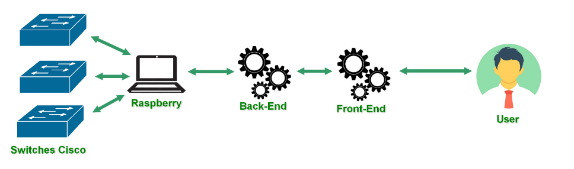
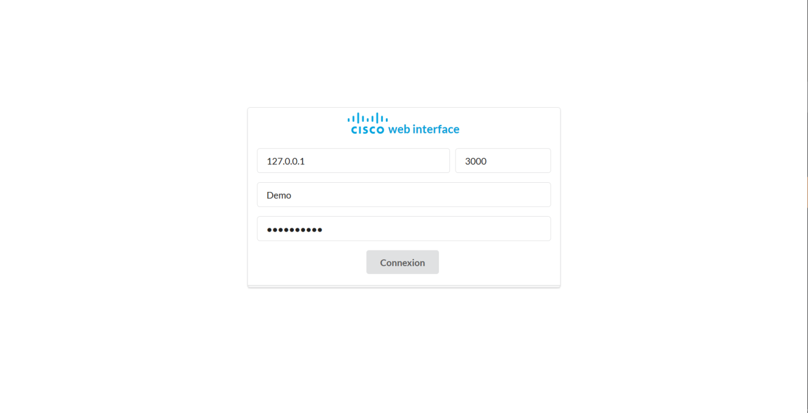
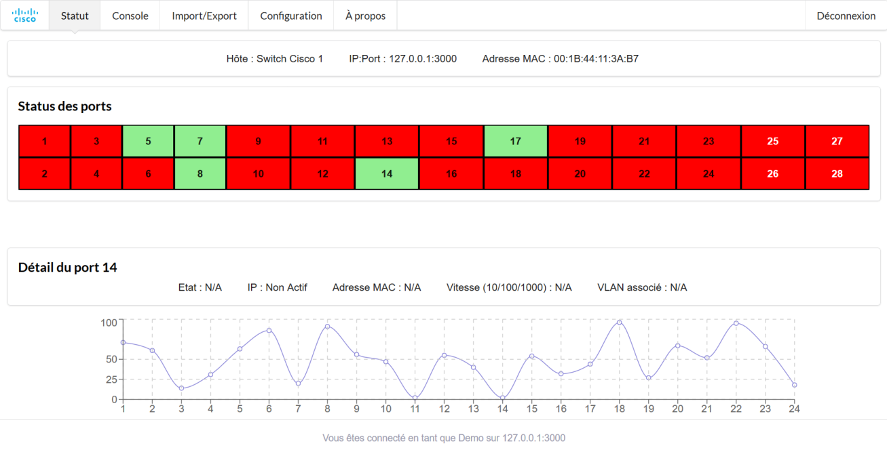
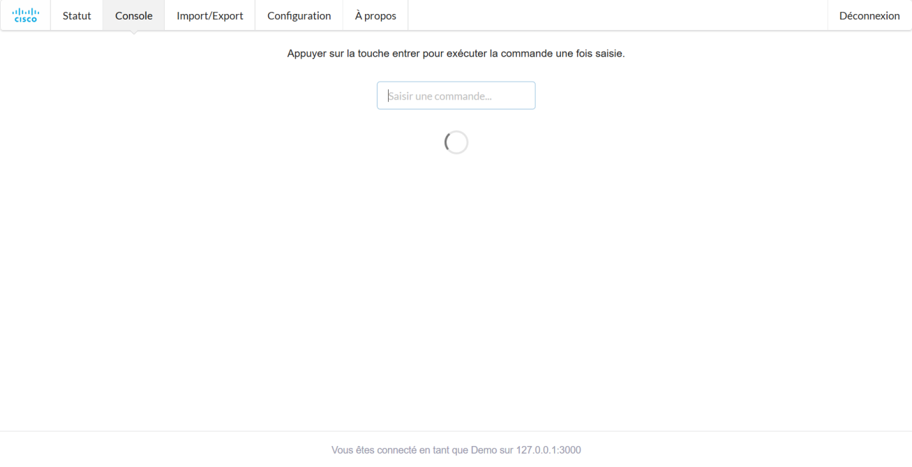
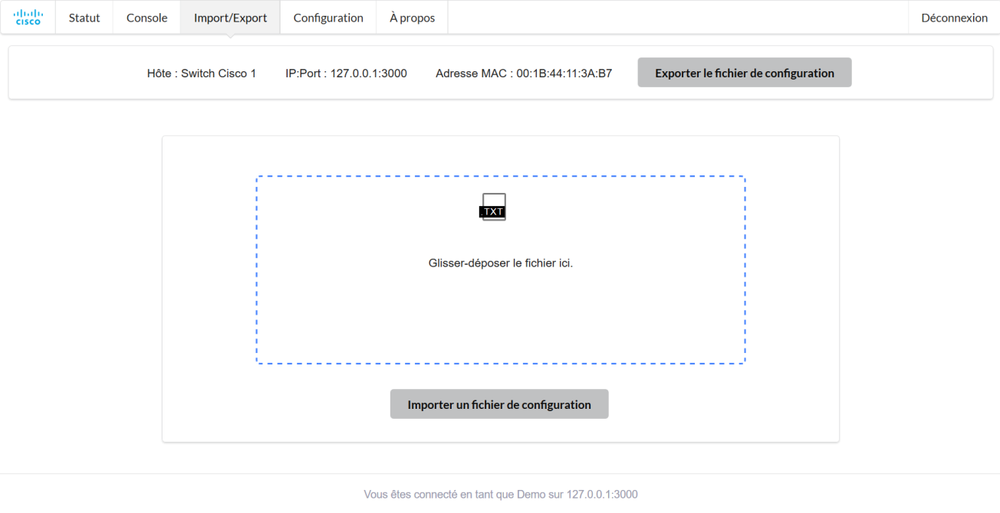
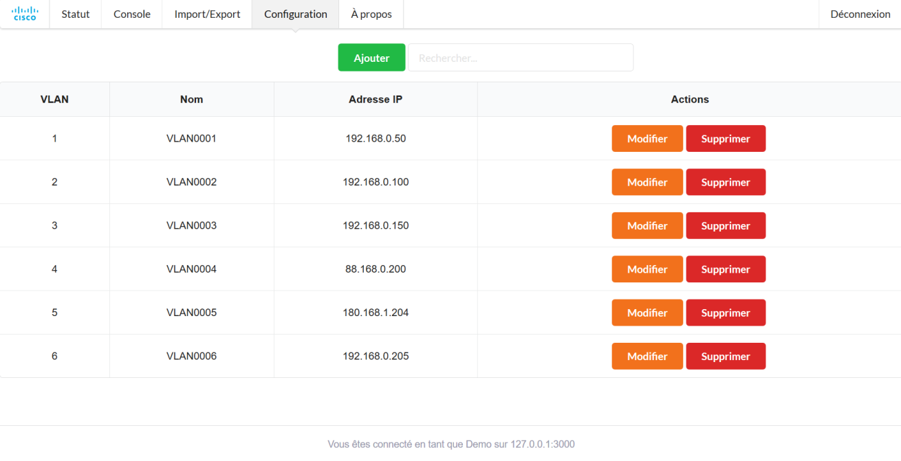
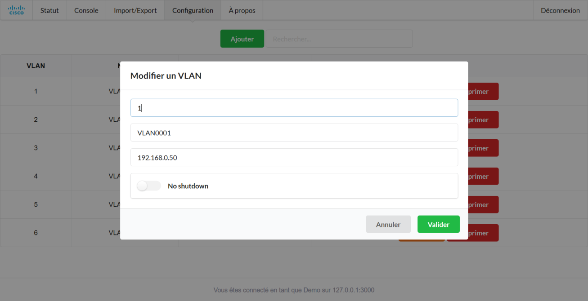
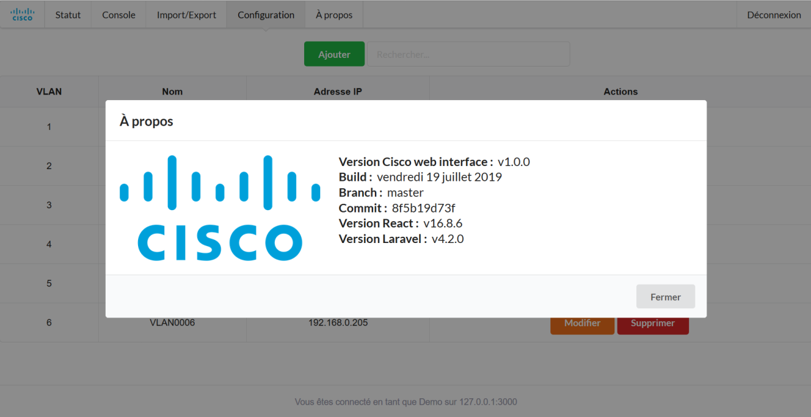

# <b>Projet Cisco</b>

Projet commun entre promo dev et réseaux. J'ai realisé l'application côté front end.

## 📄 <b>Contexte</b>
Dans notre établissement nous avons à notre disposition une salle composée d’utilitaires réseaux (router, switch, baie de brassage…). 
Sujet : réaliser une application permettant de gérer cette infrastructure via une interface simple d’utilisation. 
Cette application devra permettre de se connecter à un switch Cisco mais elle devra aussi permettre de l’administrer.

## 🏛️ <b>Architecture</b>

## 👁️ <b>Aperçu</b>

Vue de connexion

Page d'accueil

Console

Importer/Exporter des fichiers de configuration

Configuration de VLAN

Modifier un VLAN

À propos
